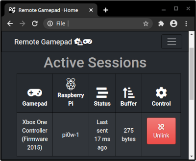

# remotegamepad

Remote Gamepad allows you or your friends to use any browser-supported gamepad
to mimic a Nintendo Switch Pro Controller by using a Raspberry Pi as a relay.

## How It Works

* Web browsers have a [Gamepad API](https://caniuse.com/gamepad).  You can check if your gamepad/controller is supported at [Gamepad Tester](https://gamepad-tester.com/).
* Inexpensive devices such as the Raspberry Pi Zero W are capable of imitating a Nintendo Switch Pro Controller when placed in OTG/USB gadget mode.
* Remote Gamepad provides some glue between the two by setting up button mapping and sending a stream of controller data to the Raspberry Pi which in turn will relay it to the Switch via USB.

If you have a capture card and a low latency way to share the video stream, you
can game with friends who don't have a Switch over the internet.  Map/redirect a
port on your router/gateway to port 8085 on your Raspberry Pi and have your
friend connect to it with their browser.

## Requirements

* Nintendo Switch
* Nintendo Switch Dock
* Raspberry Pi Zero W, Raspberry Pi 4 Model B, or other board cable of OTG mode+network
* Browser support for your controller/gamepad

## Pi Setup

Enable dwc2 USB controller driver

    echo "dtoverlay=dwc2" | sudo tee -a /boot/config.txt

Enable needed kernel modules

    echo "dwc2" | sudo tee -a /etc/modules-load.d/dwc2.conf
    echo "libcomposite" | sudo tee -a /etc/modules-load.d/libcomposite.conf

Reboot for changes to take effect

    sudo reboot

Download [add_procon_gadget.sh](https://gist.github.com/mzyy94/60ae253a45e2759451789a117c59acf9#file-add_procon_gadget-sh)
and run it with root privileges.  By default the resulting device, `/dev/hidg0` can only be used by root. You should chown/chmod like so:

    sudo chown root:dialout /dev/hidg0
    sudo chmod 660 /dev/hidg0

If you're going to be using the setup long-term, a udev rule should be used instead.

## Launch

[Download the release](https://github.com/jolan/remotegamepad/releases), extract it, 
`cd` into the directory and run `./remotegamepad`

Or get the source:

    go get -u -v github.com/jolan/remotegamepad

And then build and run it:

    cd ~/go/src/github.com/jolan/remotegamepad && go build && ./remotegamepad

Or cross-compile it and then copy everything to the Raspberry Pi:

    env GOOS=linux GOARCH=arm GOARM=6 go build

The binary expects to find `webroot` in the same directory that is run from.

Finally, enter the URL to your Raspberry Pi (e.g. http://192.0.2.53:8085) into your browser.

## Adding A Profile For A Controller

1. Go to https://gamepad-tester.com/.
2. Copy/paste the full controller name and annotate the button layout for your controller in gamepadStateSend().
3. Add shortname to gamepadShortName().

## Limitations

* Non-Switch controllers cannot be used to wake the system from sleep.
* Starting a session requires the Switch to be out of sleep mode.
* At the moment, the supported controller list is hardcoded and tiny.
* Can only use a single gamepad per computer (seems to be a browser limitation).
* Every remote gamepad requires their own Raspberry Pi/relay device.

## Roadmap

* Add profiles for common controllers like Wii U, DualShock, Xbox 360, etc.
* Add button mapping dialog for controllers using the default profile.
* Improve binary release with systemd service, config/logging options, udev rule, etc.
* Code cleanup.
* Add mouse/keyboard support.
* Test on non-Chrome browsers to check for bugs/quirks.
* Determine if multiple controllers-on-a-single PC is possible.
* Add audio/video streaming support.
* Maybe support consoles other than the Switch one day.

## Acknowledgements

@mzyy94 - remotegamepad borrows much of the functionality from his work.

* https://github.com/mzyy94/nscon
* https://github.com/mzyy94/ns-remote
* https://mzyy94.com/blog/2020/03/20/nintendo-switch-pro-controller-usb-gadget/
* https://mzyy94.com/blog/2020/04/17/nintendo-switch-audio-uac-gadget/
* https://mzyy94.com/blog/2020/05/11/play-nintendo-switch-on-smartphone/
* https://mzyy94.com/blog/2020/05/12/raspberry-pi-hdmi-edid-cec/

Thanks to others for precursor/similar/inspiring work:

* @dekuNekum - https://github.com/dekuNukem/Nintendo_Switch_Reverse_Engineering
* @shinyquagsire23 - https://github.com/shinyquagsire23/HID-Joy-Con-Whispering
* @Xfennec - https://gist.github.com/Xfennec/e1215febb15b40c21bf029b38a31640b
* @mumumusuc - https://github.com/mumumusuc/pi-joystick
* @omakoto - https://github.com/omakoto/raspberry-switch-control
* @mart1nro - https://github.com/mart1nro/joycontrol
* @javmarina - https://github.com/javmarina/Nintendo-Switch-Remote-Control
* @ndeadly - https://github.com/ndeadly/MissionControl
* Parsec - https://www.youtube.com/watch?v=uTlwVyWobRc

## License

[GPL v3](LICENSE)
